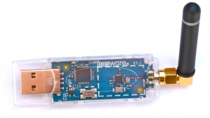
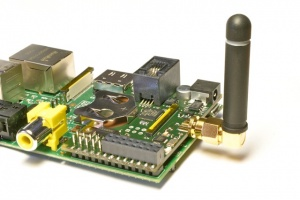

Configuration
#############

.. highlight:: bash

homematicbidcos.conf
********************

The configuration file for the HomeMatic BidCoS module, ``homematicbidcos.conf``, can be found in Homegear's family configuration directory (by default /etc/homegear/families). In this file you can set all family specific options and configure the communication modules to use. The general section looks like this::

	[General]

	## The BidCoS address of Homegear. It is recommended to change this to a random 3 byte hexadecimal
	## value starting with 0xFD (e. g. 0xFD43AB). Only change this, when no HomeMatic BidCoS devices
	## are paired to Homegear as existing pairings will not work anymore!
	#centralAddress = 0xFD0001

	## Specify a 16 byte (32 characters) long AES key here to protect your wireless communication
	## !!! IMPORTANT: It is highly recommended to change this key before pairing the first device.
	## !!! IMPORTANT: Never ever lose this key. That would render your devices useless.
	## To remove the key from your devices, you need to factory reset them
	rfKey = 00112233445566778899AABBCCDDEEFF

	## With each key change currentRFKeyIndex needs to be
	## incremented by 1
	currentRFKeyIndex = 1

	## When you change rfKey, put the old key here. To change the key Homegear needs to know the
	## old and the new one.
	## !!! Do not set oldRFKey when you set rfKey for the first time !!!
	##oldRFKey = 00112233445566778899AABBCCDDEEFF

Before you start using the HomeMatic BidCoS module, you should change ``centralAddress`` to a 3-byte value of your choice - e. g. 0xFD1C2B or 0xFDD394. I recommend the new value to start with "0xFD", too, to not accidently use an address already in use by a device. You should also change ``rfKey`` to secure the communication with your HomeMatic devices.

.. warning:: Don't change ``centralAddress`` after pairing HomeMatic BidCoS devices to Homegear.

.. _communication-modules:

Communication Modules
*********************

Overview
========

The HomeMatic BidCoS module supports the following communication modules:

	* :ref:`CUL (busware) <config-cul>`
	* :ref:`COC (busware) <config-coc>`
	* :ref:`CCD (busware) <config-coc>`
	* :ref:`CSM (busware) <config-coc>`
	* :ref:`SCC (busware) <config-coc>`
	* :ref:`CUNX (busware) <config-cunx>`
	* :ref:`HomeMatic Wireless Module for Raspberry Pi (HM-MOD-RPI-PCB, eQ-3) <config-hm-mod-rpi-pcb>`
	* :ref:`HomeMatic LAN Configuration Adapter (HM-CFG-LAN, eQ-3) <config-hm-cfg-lan>`
	* :ref:`HomeMatic LAN Gateway (HM-LGW, eQ-3): Crashes sometimes <config-hm-lgw>`
	* :ref:`HomeMatic USB Configuration Adapter (HM-CFG-USB(-2), eQ-3) <config-hm-cfg-usb>`
	* :ref:`CC1101 (Texas Instruments) <config-ticc1101>`
	* :ref:`CC1101 with CC1190 (Texas Instruments) <config-ticc1101-cc1190>`

If you just want a system that works without you having to invest a lot of time, buy the CUL stick. Of the devices in the list, it is probably the easiest to use. Additionally, it can be connected to a good antenna and supports AES handshakes and firmware updates.

.. note:: Of course, you can use multiple communication modules at the same time.

The HomeMatic BidCoS communication modules need to be configured in ``homematicbidcos.conf``.

.. _config-cul:

CUL
===

The CUL from `busware <http://busware.de/tiki-index.php?page=CUL>`_ is the most easy to use hardware to communicate with HomeMatic BidCoS devices. The only disadvantage is the bad control over the packet timing due to the use of USB.

Downloading the Prerequisites
-----------------------------

In order to be able to flash the CUL you need to install dfu-programmer. In Debian just run::

	apt-get install dfu-programmer

Flashing the Firmware
---------------------

Download the firmware from `culfw.de <http://culfw.de/>`_ and extract it::

	wget http://culfw.de/culfw-1.58.tar.gz
	tar -zxf culfw-1.58.tar.gz

Change to the directory with the CUL firmware::

	cd CUL_VER_*/culfw/Devices/CUL

Now press the PROGRAM button on the back side of your CUL and keep it pressed while plugging the CUL in. The green LED should NOT flash. Then execute::

	dfu-programmer atmega32u4 erase
	dfu-programmer atmega32u4 flash CUL_V3.hex
	dfu-programmer atmega32u4 reset

Plug out and plug in your CUL again and you are done!

Configuring Homegear to Use the CUL
-----------------------------------

To tell Homegear to use the CUL place these lines into ``homematicbidcos.conf``::

	[CUL]
	id = My-CUL
	# Uncomment this if you want this CUL to be your default communication module.
	#default = true
	deviceType = cul
	device = /dev/ttyACM0
	responseDelay = 95

Of course you can use multiple CUL with Homegear.

.. _config-coc:

COC/CCD/SCC
===========

The COC from `busware <http://busware.de/tiki-index.php?page=CUL>`_ is a Raspberry Pi extension to communicate with wireless home automation devices. Because the communication between COC and Raspberry Pi is serial, the packet timing is much better than with a CUL.

Downloading the Prerequisites
-----------------------------

In order to be able to flash the COC you need to install avrdude. In Debian just run::

	apt-get install avrdude

Free Up Serial Line
-------------------

Remove any references to ttyAMA0 from /etc/inittab and /boot/cmdline.txt.

My /boot/cmdline.txt looks like this::

	dwc_otg.lpm_enable=0 console=tty1 root=/dev/mmcblk0p2 rootfstype=ext4 elevator=deadline rootwait

And the last lines of my /etc/inittab (I just added the comment in front of the last line)::

	#T3:23:respawn:/sbin/mgetty -x0 -s 57600 ttyS3
	 
	 
	#Spawn a getty on Raspberry Pi serial line
	#T0:23:respawn:/sbin/getty -L ttyAMA0 115200 vt100

Reboot the Raspberry Pi. 

Flashing the Firmware
---------------------

Download the firmware from culfw.de and extract it::

	wget http://culfw.de/culfw-1.58.tar.gz
	tar -zxf culfw-1.58.tar.gz

Change to the directory with the COC firmware::

	cd CUL_VER_*/culfw/Devices/COC

Then execute (just copy and paste the commands)::

	if test ! -d /sys/class/gpio/gpio17; then echo 17 > /sys/class/gpio/export; fi
	if test ! -d /sys/class/gpio/gpio18; then echo 18 > /sys/class/gpio/export; fi
	echo out > /sys/class/gpio/gpio17/direction
	echo out > /sys/class/gpio/gpio18/direction
	echo 0 > /sys/class/gpio/gpio18/value
	echo 0 > /sys/class/gpio/gpio17/value
	sleep 1
	echo 1 > /sys/class/gpio/gpio17/value
	sleep 1
	echo 1 > /sys/class/gpio/gpio18/value
	 
	avrdude -p atmega1284p -P /dev/ttyAMA0 -b 38400 -c avr109 -U flash:w:COC.hex

Configuring Homegear to Use the COC/CCD/CSM/SCC
-----------------------------------------------

To tell Homegear to use the CUL place these lines into ``homematicbidcos.conf``::

	[COC/CCD/CSM/SCC]
	id = My-COC
	# Uncomment this if you want this device to be your default communication module.
	#default = true
	deviceType = coc
	device = /dev/ttyAMA0
	responseDelay = 95
	gpio1 = 17
	gpio2 = 18
	# Set stackPositition if you use stacking (starting with "1" for the SCC at the bottom).
	# stackPosition = 1

If you want to stack multiple SCC, you need to set "stackPosition". Use "1" for the SCC at the bottom, "2" for the second SCC, "3" for the next one and so on.

.. _config-cunx:

CUNX
====

To tell Homegear to use the CUNX place these lines into ``homematicbidcos.conf``::

	[CUNX]
	id = My-CUNX
	# Uncomment this if you want this CUNX to be your default communication module.
	#default = true
	deviceType = cunx
	# IP address of your CUNX
	host = 192.168.178.100
	port = 2323
	responseDelay = 93

Of course you can use multiple CUNX.

.. _config-hm-mod-rpi-pcb:

HomeMatic Wireless Module for Raspberry Pi (HM-MOD-RPI-PCB)
===========================================================

To tell Homegear to use the HM-MOD-RPI-PCB place these lines into ``homematicbidcos.conf``::

	[HomeMatic Wireless Module for Raspberry Pi]
	id = My-HM-MOD-RPI-PCB
	# Uncomment this if you want the HM-MOD-RPI-PCB to be your default communication module.
	#default = true
	deviceType = hm-mod-rpi-pcb
	device = /dev/ttyAMA0
	responseDelay = 95
	gpio1 = 18

.. _config-hm-cfg-lan:

HomeMatic LAN Configuration Adapter (HM-CFG-LAN)
================================================

To tell Homegear to use the HM-CFG-LAN place these lines into ``homematicbidcos.conf``::

	[HM-CFG-LAN]
	id = My-HM-CFG-LAN
	# Uncomment this if you want this HM-CFG-LAN to be your default communication module.
	#default = true
	deviceType = hmcfglan
	# IP address of your HM-CFG-LAN
	host = 192.168.178.100
	port = 1000
	# Put the AES key printed on your HM-CFG-LAN here
	lanKey = 00112233445566778899AABBCCDDEEFF
	responseDelay = 60

Of course you can connect multiple LAN Configuration Adapters to Homegear.

.. _config-hm-lgw:

HomeMatic LAN Gateway (HM-LGW)
==============================

To tell Homegear to use the HM-LGW place these lines into ``homematicbidcos.conf``::

	[HomeMatic Wireless LAN Gateway]
	id = My-HM-LGW
	# Uncomment this if you want this HM-LGW to be your default communication module.
	#default = true
	deviceType = hmlgw
	# IP address of your HM-LGW
	host = 192.168.178.100
	port = 2000
	portKeepAlive = 2001
	# Put the security key printed on your HM-LGW here
	lanKey = SecurityKey
	responseDelay = 60
	# Some LAN-Gateways do not send packets correctly. If sent packets are not received by the
	# devices (you get error messages, that packets were not received after 3 retries), set
	# sendFix to true.
	#sendFix = false

Of course you can connect multiple gateways to Homegear. Mind the option ``sendFix`` if your LAN Gateway doesn't seem to work.

.. _config-hm-cfg-usb:

HomeMatic USB Configuration Adapter (HM-CFG-USB[-2])
====================================================

For the HM-CFG-USB to be usable with Homegear, you need to set up the `HM-CFG-USB{,2} linux utilities <https://git.zerfleddert.de/cgi-bin/gitweb.cgi/hmcfgusb>`_ first. After that, the HM-CFG-USB can be used like a HM-CFG-LAN.

To tell Homegear to use the HM-CFG-USB place these lines into ``homematicbidcos.conf``::

	[HM-CFG-USB]
	id = hmland
	# Uncomment this if you want this HM-CFG-USB to be your default communication module.
	#default = true
	deviceType = hmcfglan 
	# IP address running the hmland service
	host = 127.0.0.1
	# Port number of the hmland service
	port = 1234
	responseDelay = 60

.. _config-ticc1101:

Texas Instruments CC1101
========================

See the figure on how to connect the CC1101 to the Raspberry Pi. Of course you can use the module on other computers, too. There are just two requirements:

* One interrupt supporting GPIO
* Userspace SPI device (like /dev/spidevX.X)

.. figure:: images/ti-cc1101.png
	:width: 300px

	Thanks to Qnerd.

.. note:: See `this forum post <https://forum.homegear.eu/viewtopic.php?f=16&t=10>`_ for more detailed information.

To tell Homegear to use the CC1101 place these lines into ``homematicbidcos.conf``::

	[TI CC1101 Module]
	id = My-CC1101
	# Uncomment this if you want this HM-CFG-USB to be your default communication module.
	#default = true
	deviceType = cc1100
	# The SPI device, the module is connected to.
	device = /dev/spidev0.0
	responseDelay = 100
	# The interrupt pin to use. "0" for GDO0 or "2" for GDO2.
	# You only need to connect one of them. Specify the GPIO
	# you connected the interrupt pin to below.
	interruptPin = 2
	# The GPIO GDO0 or GDO2 is connected to. Specify which GDO to use above.
	gpio1 = 23

.. _config-ticc1101-cc1190:

Texas Instruments CC1101 with CC1190
====================================

Follow the instructions for the CC1101 above. Then place these lines into ``homematicbidcos.conf``::

	id = My-CC1101
	# Uncomment this if you want this HM-CFG-USB to be your default communication module.
	#default = true
	deviceType = cc1100
	# The SPI device, the module is connected to.
	device = /dev/spidev0.0
	responseDelay = 100
	# The interrupt pin to use. "0" for GDO0 or "2" for GDO2.
	# You only need to connect one of them. Specify the GPIO
	# you connected the interrupt pin to below.
	interruptPin = 2
	# The GPIO GDO0 or GDO2 is connected to. Specify which GDO to use above.
	gpio1 = 23

	### Additional TI CC1190 Config ###
	# The GPIO high gain mode of the CC1190 is connected to.
	gpio2 = 5

	# The hexadecimal value for the PATABLE of the TI CC1101.
	# Set to 0x27, if high gain mode is enabled. That is the maximum legally allowed setting.
	txPowerSetting = 0x27

.. note:: See the `Homegear forum <https://forum.homegear.eu/viewtopic.php?f=16&t=499>`_ for more detailed information.