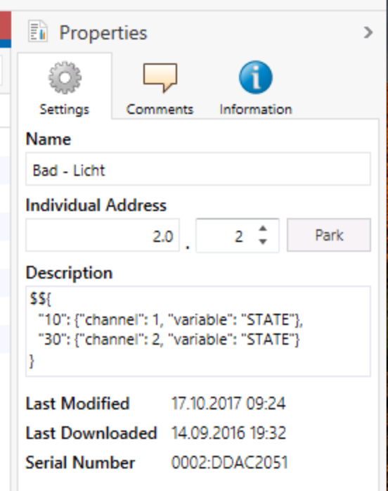
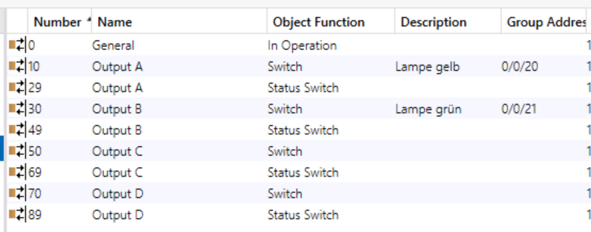

Adding KNX Devices
##################

.. highlight:: bash

Make sure the KNX module is up and running before you continue reading this chapter.

Map Each Group Address to One Homegear Device
*********************************************

The following steps show you how to add KNX group addresses to Homegear. Each group address is mapped to one Homegear device. It is mandatory to assign a data type to each group address. Otherwise Homegear can't import the variable as there is no safe way to detect it's type. To learn how to group multiple KNX group addresses together into one Homegear device follow the steps in section :ref:`grouped-addresses-1` or :ref:`grouped-addresses-2`.

1. Export your KNX project file (file ending .knxproj).
2. Place this file in Homegear's KNX device description directory. By default this is ``/etc/homegear/devices/14/``.

Now there are two ways to add the devices. Either by using Homegear's Command Line Interface (CLI) or by calling the RPC method ``searchDevices()``.

.. _search-devices:

Search for Devices Using the CLI
================================

1. Start the CLI by executing::

	homegear -r

2. Switch to the KNX family::

	families select 14

3. Search for new KNX devices::

	search

4. Now ``ls`` should show all found devices.

If a group address was already known to Homegear the Homegear device is updated. There is no need to previously delete the Homegear device.

.. note:: Homegear never automatically deletes devices. You always have to delete them manually if not needed anymore.

Search for Devices Using RPC
============================

You can also search for devices by calling the RPC method ``searchDevices()``. The easiest to do so is by executing an inline PHP script on the command line::

	homegear -e rc 'print_v($hg->searchDevices());'

Of course you can use all other RPC protocols supported by Homegear to call this method.

.. important:: It is necessary to assign a type to each group variable Homegear should import. Otherwise the group variable won't be imported as there is no safe way to detect it's data type.

.. _grouped-addresses-1:

Add KNX Devices to Homegear
***************************

In addition to importing the plain group variables, Homegear can import whole KNX devices with all group variables assigned. All the group variables assigned to the KNX device will then be grouped together in that device in Homegear, too. For that, a JSON object must be placed into the description field of the device. The JSON object has to start with ``$${``. Around the JSON object any other text is still allowed. 

.. important:: If there is at least one JSON object present, group addresses without JSON are ignored.

	Description field with a device's JSON metadata in ETS 5.

	Device's parameters with index in the "Number" column.

You need to add an entry to the JSON object for each parameter that should be available in Homegear. The parameter needs a group variable with selected data type assigned to it. Each parameter has an index visible in the "Number" column in ETS. This index is the key in the JSON object. The value again is an JSON object with the following possible keys:

+-----------+-----------+-------------------------------------------------------------------------------------------------------------------+---------------+---------+
| Key       | JSON type | Description                                                                                                       | Example       | Default |
+===========+===========+===================================================================================================================+===============+=========+
+-----------+-----------+-------------------------------------------------------------------------------------------------------------------+---------------+---------+
| channel   | integer   | The channel number the group variable should be placed in.                                                        | 1             | 1       |
+-----------+-----------+-------------------------------------------------------------------------------------------------------------------+---------------+---------+
| variable  | string    | The name the group variable should have in Homegear.                                                              | "STATE"       | "VALUE" |
+-----------+-----------+-------------------------------------------------------------------------------------------------------------------+---------------+---------+
| unit      | string    | The unit (m², l, h, °C, ...) that should be displayed in Homegear.                                                | "°C"          | ""      |
+-----------+-----------+-------------------------------------------------------------------------------------------------------------------+---------------+---------+

Readonly or writeonly are detected automatically. For a switching actuator with two outputs used (= two channels), the JSON could look like::

    $${
      "10": {"channel": 1, "variable": "STATE"},
      "30": {"channel": 2, "variable": "STATE"}
    }

Parameter ``10`` (Output A, switch) will be mapped to the variable ``STATE`` on channel 1 in Homegear and parameter ``30`` (Output B, switch) to ``STATE`` on channel 2.

.. note:: If the room name the KNX device is assigned to exists in Homegear (in any language), the device will automatically be added to that room. Also the name of the KNX device is imported.

.. _grouped-addresses-2:

Manually Group Multiple KNX Group Addresses in One Homegear Device
******************************************************************

The following steps show you how to manually add multiple KNX group addresses into one "virtual" Homegear device. This enables you to group variables any way you like. The meta data needs to be added in the description field of the group variables. It needs to be formatted as a JSON object starting with ``$${``. Around the JSON object any other text is still allowed in the description field. 

.. important:: If there is at least one JSON object present, group addresses without JSON are ignored.

.. figure:: images/group-variable-metadata.png
	:width: 300px

	Description field with JSON metadata in ETS 5.

The following keys are available:

+-----------+-----------+-------------------------------------------------------------------------------------------------------------------+---------------+---------+
| Key       | JSON type | Description                                                                                                       | Example       | Default |
+===========+===========+===================================================================================================================+===============+=========+
| id        | string    | The ID of the Homegear device. All devices with the same ID are grouped together.                                 | "Main switch" | ""      |
+-----------+-----------+-------------------------------------------------------------------------------------------------------------------+---------------+---------+
| type      | integer   | The type ID of the device. Needs to unique per device. You only need to specify it once for each Homegear device. | 5             | 0       |
+-----------+-----------+-------------------------------------------------------------------------------------------------------------------+---------------+---------+
| channel   | integer   | The channel number the group variable should be placed in.                                                        | 1             | 1       |
+-----------+-----------+-------------------------------------------------------------------------------------------------------------------+---------------+---------+
| variable  | string    | The name the group variable should have in Homegear.                                                              | "STATE"       | "VALUE" |
+-----------+-----------+-------------------------------------------------------------------------------------------------------------------+---------------+---------+
| unit      | string    | The unit (m², l, h, °C, ...) that should be displayed in Homegear.                                                | "°C"          | ""      |
+-----------+-----------+-------------------------------------------------------------------------------------------------------------------+---------------+---------+
| readable  | boolean   | Set to "false" to mark variable as "write only".                                                                  | false         | true    |
+-----------+-----------+-------------------------------------------------------------------------------------------------------------------+---------------+---------+
| writeable | boolean   | Set to "false" to mark variable as "read only"                                                                    | false         | true    |
+-----------+-----------+-------------------------------------------------------------------------------------------------------------------+---------------+---------+

All group variables with the same value for ``id`` are grouped together. For each device a unique number for ``type`` needs to be specified. Each variable needs a unique value for ``variable`` within one channel. All other keys are optional.

Example
=======

Let's say you have two push buttons with two switchable status LEDs you want to group together into one Homegear device. The id of the device should be "My Push Buttons", the type number "4215" (you can choose any unique value you like). The names of the push button state variables should be "PRESS" and the name of the status LED variables should be "LED_STATE". "PRESS" should be read only. The variables of the first push button should be placed into channel 1 and the variables of the second push button into channel 2. Then the text you need to place into the ETS description fields of the four variables is:

+---------------------------+------------------------------------------------------------------------------------------------------+
| KNX group variable        | JSON object                                                                                          |
+===========================+======================================================================================================+
| Push button 1 "PRESS"     | ``$${"id": "My Push Buttons", "type": 4215, "channel": 1, "variable": "PRESS", "writeable": false}`` |
+---------------------------+------------------------------------------------------------------------------------------------------+
| Push button 1 "LED_STATE" | ``$${"id": "My Push Buttons", "channel": 1, "variable": "LED_STATE"}``                               |
+---------------------------+------------------------------------------------------------------------------------------------------+
| Push button 2 "PRESS"     | ``$${"id": "My Push Buttons", "channel": 2, "variable": "PRESS", "writeable": false}``               |
+---------------------------+------------------------------------------------------------------------------------------------------+
| Push button 2 "LED_STATE" | ``$${"id": "My Push Buttons", "channel": 2, "variable": "LED_STATE"}``                               |
+---------------------------+------------------------------------------------------------------------------------------------------+

Now follow the steps in section :ref:`search-devices`.

Variable Representation in Homegear
***********************************

The KNX datapoint type is converted to an appropriate type in Homegear. Some KNX datapoint types are too complex to represent them in one variable. In this case, it is split into multiple variables. Let's say the name of the complex variable is "MY_VAR". Then every variable will start with "MY_VAR" followed by a "." and a subvariable name. The raw value can by accessed through "MY_VAR.RAW". The subvariable values can be accessed by datapoint specific names. Subvariable values can be set like any other variable. But to send the changes you need to call "MY_VAR.SUBMIT".

Example:
========

The datapoint type is "DPT-30 (DPST-30-1010)". The variable name is "STATES". The peer ID is 161. The channel is 1. In this case there will be 26 variables. "STATES.RAW", "STATES.STATE_1" to "STATES.STATE_24" and "STATES.SUBMIT". To set "STATES.STATE_5" to "true" and "STATES.STATE_10" to "false" with inline PHP execute on the command line::

	homegear -e rc '$hg->setValue(161, 1, "STATES.STATE_5", true);'
	homegear -e rc '$hg->setValue(161, 1, "STATES.STATE_10", false);'
	homegear -e rc '$hg->setValue(161, 1, "STATES.SUBMIT", true);'

Alternatevily you could've set "STATES.RAW"::

	homegear -e rc '$hg->setValue(161, 1, "STATES.RAW", hexdec("80000"));'
